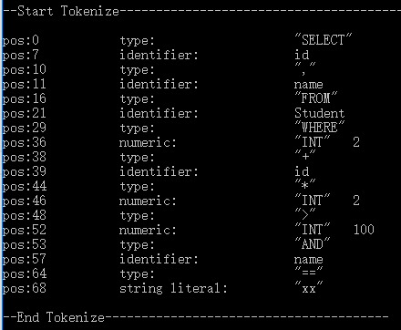
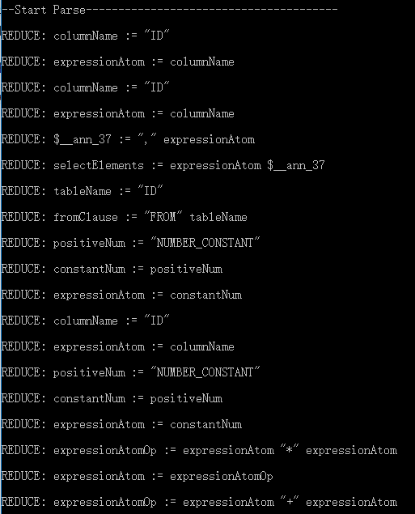
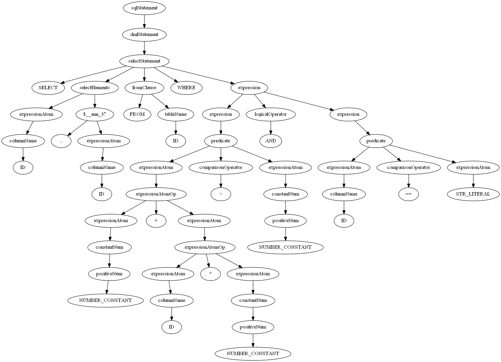
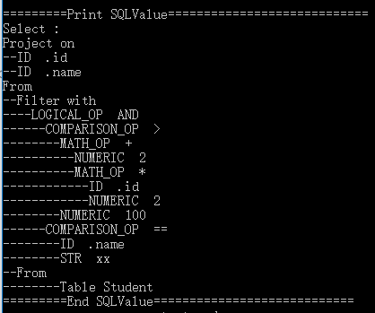

> The main part of the project has been transferred to [xjbDB](https://github.com/rsy56640/xjbDB), only this readme will be up-to-date

# Introduction

> This project is front end part of database-miniDB for the course software engineering

### Processing flow

- input (from vm)

  - accept a string of sql statement ( excluding ';' )

- lexer

  - turn the string into tokens sequence according to word-formation rules
  - tokens include keyword, identifier, numeric(int), string_literal
  - if unexcepted char occurs, throw an exception

- parse (generated by `RulesTranslator` using .tsl file)

  - accept token one by one, shift / reduce using LR1
  - syntax-directed translation, generate query plan bottom-up
  - for expression and select operation, generate ast
  - when generate query plan, check if any invalid operation occurs

- output (to vm)

  - whether the statement is valid, return a variant of query plan

  - no exception guaranteed

  - query plan includes

    - CreateTableInfo
    - DropTableInfo
    - SelectInfo
    - UpdateInfo
    - InsertInfo
    - DeleteInfo
    - Show: used to show info about database 
    - Exit: used to suggest quiting
    - ErrorMsg

    

#### Other parts of the database
- https://github.com/rsy56640/xjbDB
- https://github.com/ssyram/NovelRulesTranslator

#### documents and references

- https://www.youtube.com/playlist?list=PLSE8ODhjZXjYutVzTeAds8xUt1rcmyT7x

- https://www.bilibili.com/video/av39731185
- https://github.com/pingcap/tidb/tree/master/util/ranger
- http://tatiyants.com/postgres-query-plan-visualization/
- https://docs.faircom.com/doc/SQLExplorer/37578.htm


# Implementation

### Lexer

#### token

```cpp
/* arithmetic operator */
{ "+", type::ADD }, { "-", type::SUB }, { "*", type::MUL }, { "/", type::DIV }, { "%", type::MOD },

/* logic operator */
{ "AND", type::AND }, { "OR", type::OR },

/* compare operator */
{ "==", type::EQ }, { "!=", type::NEQ },
{ "<", type::LESS }, { ">", type::GREATER }, { "<=", type::LEQ }, { ">=", type::GEQ },

/* assign operator */
{ "=", type::ASSIGN },

/* numeric type */
{ "INT", type::INT }, 

/* special keyword */
{ "CHAR", type::CHAR }, { "VARCHAR", type::VARCHAR }, { "$", type::WILDCARD },
{ "NN", type::NOT_NULL }, { "DISTINCT", type::DISTINCT }, { "VALUES", type::VALUES },
{ "CREATE", type::CREATE },{ "DROP", type::DROP },
{ "INSERT", type::INSERT },{ "DELETE", type::DELETE },{ "UPDATE", type::UPDATE },{ "SELECT", type::SELECT },
{ "SHOW", type::SHOW},
{ "TABLE", type::TABLE },{ "FROM", type::FROM },{ "WHERE", type::WHERE },{ "JOIN", type::JOIN },
{ "ORDERBY", type::ORDERBY },{ "ASC", type::ASC },{ "DESC", type::DESC },{ "SET", type::SET },
{ "DEFAULT", type::DEFAULT },{ "PK", type::PRIMARY_KEY },{ "REFERENCES", type::REFERENCES },

/* other operator */
{ ",", type::COMMA }, { ".", type::PERIOD }, { ";", type::SEMICOLON },
{ "?", type::QUESTION }, { ":", type::COLON },
{ "(", type::LEFT_PARENTHESIS },      { ")", type::RIGHT_PARENTHESIS },
{ "[", type::LEFT_SQUARE_BRACKETS },  { "]", type::RIGHT_SQUARE_BRACKETS },
{ "{", type::LEFT_CURLY_BRACKETS },   { "}", type::RIGHT_CURLY_BRACKETS },

{"EXIT", type::EXIT},
```

#### process

- white spaces will be regarded as separators of tokens, redundant ones will be ignored

- use different analyzers to analyze char by char
- according to the token forms, analyzers include
  - word_analyzer
  - number_analyzer //support underline in a number for readablity
  - single_operator_analyzer
  - combinable_operator_analyzer
  - string_analyzer //support both single quotation mark and double quotation marks
- any unrecognized char or wrong char sequence will throw an exception which will be caught in the query phase
- if no exception, lexer will generate a stream of tokens for next steps


### miniSQL syntax

> the sql syntax is a subset of mySQL with some **modifications**

**change**

- all **keywords** are **uppercase**, which means miniSQL is case-sensitive
- only have `INT` `CHAR(n)` `VARCHAR(n)` data type

- the **wildcard** is `$` instead of `*`
- the keyword for **primary key** is `PK` instead of `PRIMARY KEY`
- the keyword for **not null** is `NN` instead of `NOT NULL`
- the **assignment symbol** `=` is only used for update set , while the **equality symbol** `==` is widely used in the where clause
- remove some optional keywords and clauses

**new** 

- support `_` in number, such as `1_000_000`  and `66_1234_0000`
- support expression in many part
  - `SELECT id + 1, "name:" + name FROM...`
  - `UPDATEXX SET name = "ID-" + name ...`
  - `INSERTXX (id, name) VALUES (1+4/2%3, "hua" + "ji")`
  - `... ORDERBY id % 10 DESC`

```
sqlStatement := ddlStatement | dmlStatement | "SHOW" | "EXIT"

ddlStatement := createTable | dropTable
dmlStatement := selectStatement | insertStatement | updateStatement | deleteStatement

createTable := "CREATE" "TABLE" tableName createDefinitions
dropTable := "DROP" "TABLE" tableName

createDefinitions := "(" createDefinition [{"," createDefinition}*] ")"
createDefinition := "ID" dataType [columnConstraint*]
dataType := "INT" | "CHAR" "(" positiveNum ")" | "VARCHAR" "(" positiveNum ")"
columnConstraint := "NOT_NULL" | "DEFAULT" expressionAtom | "PRIMARY_KEY" | "REFERENCES" tableName

insertStatement := "INSERT" tableName insertElements 
	| "INSERT" tableName "(" "ID" [{"," "ID"}*] ")" insertElements
insertElements := "VALUES" "(" expressionAtom [{"," expressionAtom}*] ")"

updateStatement := "UPDATE" tableName "SET" updateElements ["WHERE" expression]
updateElements := updateElement [{"," updateElement}*]
updateElement := columnName "=" expressionAtom

deleteStatement := "DELETE" "FROM" tableName ["WHERE" expression]

selectStatement := "SELECT" selectElements fromClause ["WHERE" expression] [orderByClause]
selectElements := "$" | expressionAtom [{"," expressionAtom}*]
fromClause := "FROM" tableName [{"," tableName}*] 
	| "FROM" tableName "JOIN" tableName
orderByClause := "ORDERBY" orderByExpression [{"," orderByExpression}*]
orderByExpression := expressionAtom ["ASC"|"DESC"]

expression := expression logicalOperator expression | predicate
predicate := expressionAtom comparisonOperator expressionAtom | expressionAtom
expressionAtom  := expressionAtom mathOperator expressionAtom | constantNum | "STR_LITERAL" | columnName

logicalOperator := "AND" | "OR"
comparisonOperator := "==" | ">" | "<" | "<=" | ">=" | "!="
mathOperator := "*" | "/" | "%" | "+" | "-"


tableName := "ID"
columnName := "ID" "." "ID" | "ID"
constantNum := ["-"] positiveNum
positiveNum := "NUMBER_CONSTANT"
```

```
CREATE TABLE USER(id INT PK, name VARCHAR(20) NN)

SELECT $ FROM USER

SELECT id + 1, "NAME:" + name FROM USER JOIN CLASS WHERE CLASS.no > 666 AND USER.id * USER.id > 3 + USER.id AND USER.name == CLASS.name + 'huaji'

INSERT USER(id,name) VALUES(123 * 6 + 233, "huaji" + "666")

UPDATE USER SET name = "huawei" + USER.id WHERE id == 1_2_3

DELETE FROM USER WHERE id == 123

DROP TABLE USER
```


### Dependency relationship (.h files)


### AST inheritance relationship

**expression AST**


- BaseExpr / AtomExpr / NonAtomExpr are virtual class and cannot be instantiated
- BaseExpr has a variable base_t identifies its actual type


**operation AST**


- BaseOp is virtual class and cannot be instantiated
- with a virtual function getOutPut
- ProjectOp / FilterOp / JoinOP are used for the three kinds of basic operations of relational algebra


### visit functions

> utility functions for specific purposes

**output visit**

output the AST to the given ostream regardless of validity

```cpp
void outputVisit(std::shared_ptr<const BaseExpr> root, std::ostream &os);

void outputVisit(std::shared_ptr<const BaseOp> root, std::ostream &os);
```

**check visit**

check visit, used in parsing phase

1. check sql semantics,
   such as `TableA.idd == 123` but here doesn't exist `idd` column in `TableA`

2. check the type matching,

   such as `WHERE "wtf" AND TableA.name == 123`

   ​	here string `"wtf"` is not supported by logicalOp `AND`

   ​	string `TableA.name` and number `123` don't matched

for any mismatching, throw DB_Exception
if passing, it is guaranteed other visit function will never encounter unexcepted cases

```cpp
void checkVisit(std::shared_ptr<const BaseExpr> root, const std::string tableName = std::string());

void checkVisit(std::shared_ptr<const AtomExpr> root, const std::string tableName = std::string());
```

**vm visit**

used to calculate the real value for a specified expression

```cpp
//for WHERE clause(expression), used for filtering values of a row
bool vmVisit(std::shared_ptr<const BaseExpr> root, table::row_view row);

//for others(expressionAtom), used for computing math/string expression and data in the specified row
table::value_t vmVisitAtom(std::shared_ptr<const AtomExpr> root, table::row_view row = NULL_ROW);
```


### Query Plan

this is an example of generating query plan

`SELECT id, name FROM Student WHERE 2 + id  * 2 > 100 AND name == "xx";`

generate token stream



parse (part)



syntax tree



query plan




# Issues

### todo

- createinfo print
- tsl delay check till know tablename
- all check visit case 
  - type mismatch
  - column existence
  - table existence
  - check pk nums
- //(shelved till check optization)check CHAR and VARCHAR length according to table structure(sometimes cannot check)


### Expansibility

- source of DML op structs should be a class, such as singleTableSource ExprTableSource、JoinTableSource、SubqueryTableSource


### optimization

- optimize expression structure when check visiting


### multi-threading (shelved)

- buffer for table structure needs read&write lock
- among simultaneous execution plans, one drops a table which another plan used it (may pass semantics check)


# Requirements

> requirements need supporting by other parts

- xx
